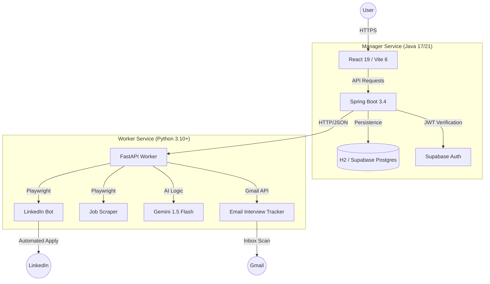

# AutoApply System Architecture 🏗️

AutoApply uses a **Hybrid Multi-Service Architecture** designed to leverage the best of both the Java and Python ecosystems.

---

## 🗺️ High-Level Component Diagram

---

## 📦 Service Breakdown

### 1. Frontend (The Interface)
- **Tech Stack**: React 19, Vite 6, Framer Motion, Tailwind CSS.
- **Responsibility**: Providing a premium, glassmorphism UI for managing job "Loops," tracking applications, and visualizing search statistics.
- **Auth**: Direct integration with Supabase Auth for session management.

### 2. Manager Service (The Orchestrator)
- **Tech Stack**: Java Spring Boot, Spring Data JPA, Spring Security.
- **Responsibility**: 
    - Managing the **Loop Lifecycle** (Start, Stop, Schedule).
    - Persisting application history and user preferences.
    - Providing a secure API for the frontend.
    - Bridging requests to the Python worker.

### 3. Worker Service (The Brain)
- **Tech Stack**: Python, FastAPI, Playwright, Gemini API.
- **Responsibility**:
    - **Automation**: Executing "Easy Apply" flows on LinkedIn/Naukri.
    - **Intelligence**: Parsing resumes and generating answers to screening questions using AI.
    - **Scraping**: Gathering live job postings based on keyword/location.
    - **Tracking**: Background scanning of user inboxes for interview invitations.

---

## 🔄 Core Data Flows

### A. Job Discovery Flow
1. User creates a "Loop" in the **Frontend**.
2. **Spring Boot** saves the Loop and triggers the **FastAPI** scraper.
3. **Python Worker** scrapes LinkedIn using Playwright and returns job JSON.
4. **Spring Boot** saves discovered jobs as "Applications" in the database.

### B. Automated Application Flow
1. User clicks "Apply with AI" in the **Frontend**.
2. **Spring Boot** sends the job URL and user's parsed profile to **FastAPI**.
3. **FastAPI** launches a headless browser, logs into LinkedIn, and fills out the application.
4. **Gemini AI** provides real-time answers for any complex screening questions.
5. Once submitted, **Spring Boot** updates the application status to `APPLIED`.

---

## 🛡️ Security & Stability
- **Authentication**: JWT-based security verified by Spring Security.
- **Audit Mode**: Capable of running in a fully decoupled local environment using H2 and mocked auth for rapid development/testing.
- **Resilience**: Separation of the long-running automation (Python) from the responsive management layer (Java).
